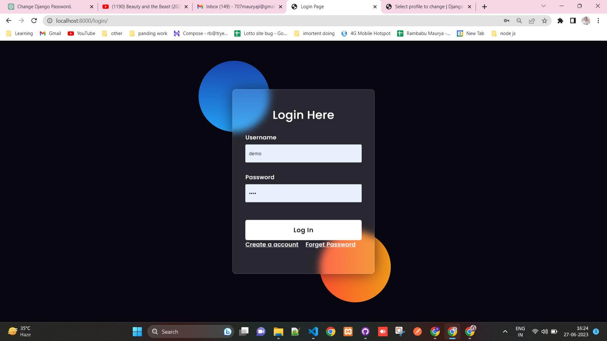
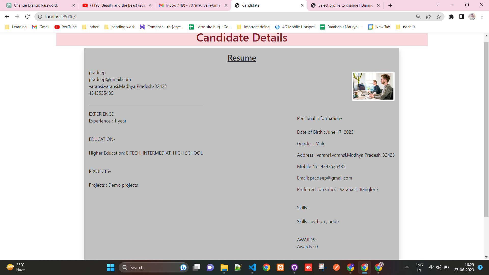

# Resume Uploader - Django

Resume Uploader is a Django-based web application that allows users to register, log in, upload resumes, and manage their resume list. It also includes features for resetting passwords using email verification.

## Features

- User Registration: Users can create an account to access the application.
- User Login: Registered users can log in securely.
- Password Reset: Users can request a password reset by providing their registered email.
- Resume Upload: Users can upload their resumes in various file formats.
- Resume List: Users can view and manage their uploaded resumes.
- PDF Generation: Resumes can be downloaded as PDF files.

## Installation

1. Clone the repository:

```
git clone https://github.com/developerMaruya/ResumeUploader-Django.git
```

2. Create a virtual environment:

```
python3 -m venv env
source env/bin/activate  # Linux/Mac
env\Scripts\activate  # Windows
```

3. Install the required dependencies:

```
pip install -r requirements.txt
```

4. Set up the database:

```
python manage.py migrate
```

5. Start the development server:

```
python manage.py runserver
```

6. Access the application in your web browser:

```
http://localhost:8000/
```

## Configuration

To use email functionality for password reset, make sure to configure the following settings in your Django project's `settings.py` file:

- `EMAIL_BACKEND`: Specify the email backend to use (e.g., SMTP or other email service).
- `EMAIL_HOST`: Set the host for the email service.
- `EMAIL_PORT`: Set the port for the email service.
- `EMAIL_HOST_USER`: Set the email address to use for sending password reset emails.
- `EMAIL_HOST_PASSWORD`: Set the password for the email account.
- `DEFAULT_FROM_EMAIL`: Set the default email address for sending emails.

## Contributing

Contributions to the Resume Uploader project are welcome. If you encounter any issues or have suggestions for improvement, please submit a pull request or open an issue on GitHub.

## License

This project is licensed under the [MIT License](LICENSE).

Feel free to modify this template to fit the specific details and structure of your project. Include additional sections or information as needed. The README file serves as a useful resource for developers and users to understand your project and get started with it.



